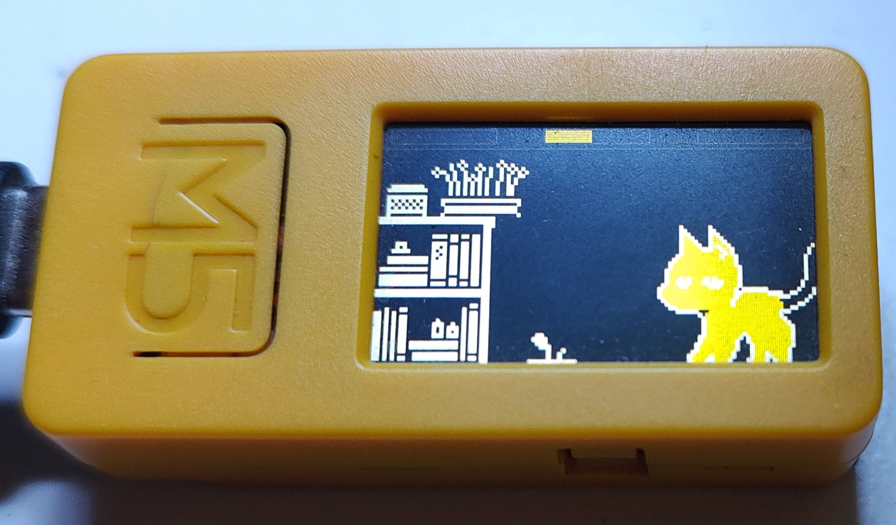
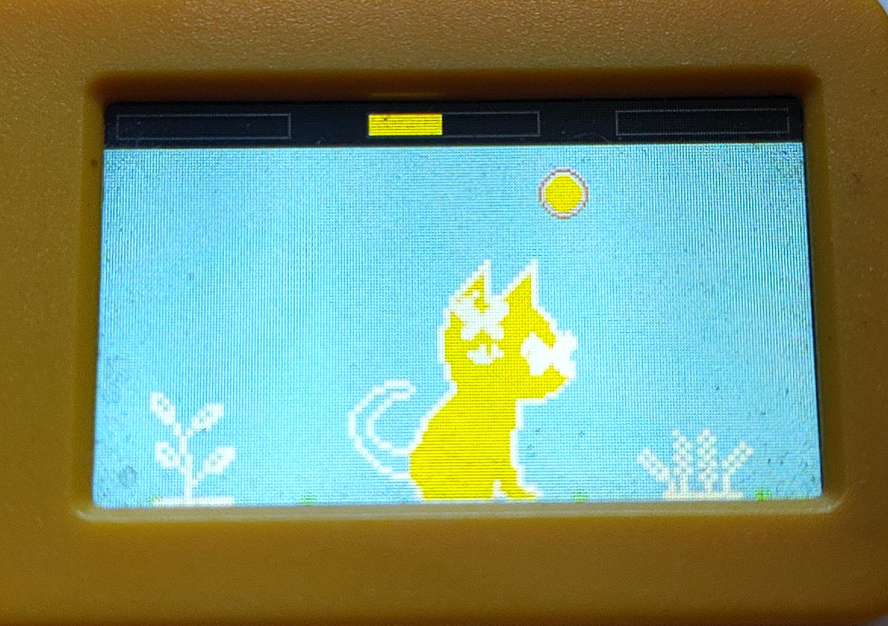
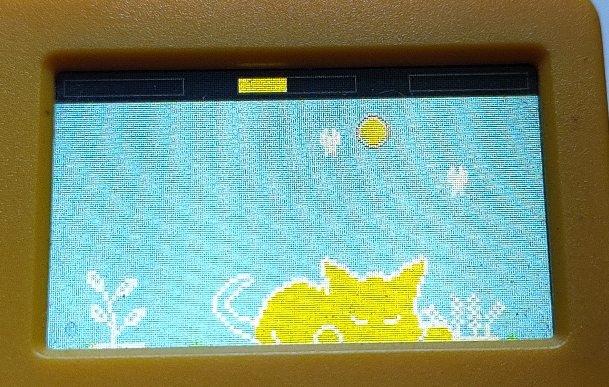

# M5Catode

A virtual cat pet for the **M5StickC Plus2**, ported from the original [catode32](https://github.com/moonbench/catode32) MicroPython project by [moonbench](https://github.com/moonbench).

Your cat lives on the screen, reacts to care, and behaves on its own. Feed it, pet it, play mini-games, and keep an eye on its stats — or it'll fall asleep on you.

| | |
|---|---|
|  |  |
|  |  |

---

## Hardware

- **M5StickC Plus2** (ESP32, 240×135 color LCD, built-in buttons)

No wiring required. Flash and go.

---

## Controls

| Button | Action |
|---|---|
| **B** (short press) | Scroll down / Next |
| **PWR** (short press) | Scroll up / Previous |
| **A** (short press) | Select / Confirm |
| **B** (long press) | Back / Close menu |
| **A** (long press) | Quick care action (pet/interact) |
| **PWR** (double press) | Open main menu from idle screen |
| **PWR** (in mini-games) | Exit to menu |

---

## Features

- Animated cat sprite with 39 poses across moods and positions
- Auto-triggered behaviors: sleeping, napping, stretching, playing, zoomies, self-grooming, investigating, vocalizing, kneading, and more
- Stat decay over time — your cat gets hungry and tired if you ignore it
- Care actions: feed meals/snacks, pet, kiss, groom, give toys
- Stats screen showing all pet stats
- Environment settings: time of day, weather, season, moon phase
- Dynamic outside sky that reacts to your environment settings
- Pet stats and environment persist across reboots

### Mini-Games

| Game | Controls |
|---|---|
| **Zoomies** | A = jump, PWR = exit |
| **Breakout** | A held = paddle left, B held = paddle right, A = launch, PWR = exit |
| **Snake** | A = turn left, B = turn right, A = start/restart, PWR = exit |
| **Tic-Tac-Toe** | B/PWR = move cursor, A = place, PWR = exit |

---

## Changes from the Original

The original catode32 runs on a custom ESP32 breadboard with an SSD1306 128×64 monochrome OLED and 8 separate buttons. This port adapts it to the M5StickC Plus2 with its built-in 240×135 color LCD and 3 buttons. Key changes:

**Platform rewrite**
- Fully rewritten in C++ (Arduino/PlatformIO) using M5Unified — the original is MicroPython
- All sprite assets converted from MicroPython bytearrays to C++ PROGMEM arrays
- Double-buffered rendering via M5Canvas to eliminate flicker

**Color display**
- Rendered in full color on the 240×135 LCD instead of monochrome OLED
- Cat sprite drawn in yellow/cream on colored backgrounds
- Dynamic sky: blue by day, orange at dawn/dusk, dark navy at night with stars and moon, gray overcast for rain and storms
- Sky reacts live to the time of day, weather, season, and moon phase set in the environment menu

**3-button control remapping**
- Original has 8 buttons (D-pad + A/B/Menu×2); adapted to BtnA, BtnB, and BtnPWR with short/long/double-press gestures

**Mini-games**
- Added **Snake** as a new mini-game
- Removed **Maze** — the original maze game required more directional buttons than the 3-button layout could comfortably support
- Fixed and tuned Breakout and Zoomies controls for the new button layout

**Stat decay & persistence**
- Stat decay was not active in the initial port; fully wired up so the cat gets hungry, tired, and restless over time matching the original's rates
- Pet stats and environment settings save to flash (NVS) and restore on reboot

---

## Flashing

### Option 1 — M5Burner (easiest)

1. Open [M5Burner](https://docs.m5stack.com/en/download)
2. Search for Catode32
3. Flash to your M5StickC Plus2

### Option 2 — PlatformIO

```bash
cd M5Catode
pio run --target upload
```

Requires [PlatformIO](https://platformio.org/) and the M5StickC Plus2 connected via USB.

### Option 3 — esptool

```bash
esptool.py --chip esp32 --port /dev/ttyUSB0 --baud 921600 \
  write_flash 0x0 release/M5Catode-v1.0-MERGED.bin
```

---

## Building from Source

```bash
cd M5Catode
pio run
```

Output: `.pio/build/m5stickc-plus2/firmware.bin`

Dependencies are managed by PlatformIO (`M5Unified`).

---

## Credits

Original project: **[catode32](https://github.com/moonbench/catode32)** by [moonbench](https://github.com/moonbench)
— a virtual pet written in MicroPython for ESP32 with an SSD1306 OLED display.

All cat sprites, behavior logic, stat system, and scene design originate from that project. This repo is a hardware port, not a fork of the original codebase.
NOTE: the original appears to do a LOT more than this one. I have not tested this very much. 
---

## License

Refer to the [original project's license](https://github.com/moonbench/catode32).
